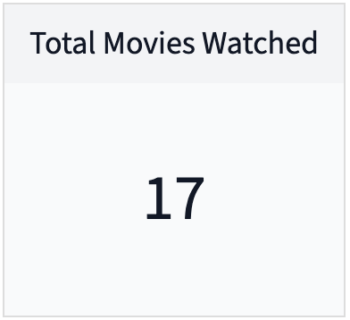

# Logseq Metrics Plugin
A Logseq plugin for tracking and mesuring personal habits, goals, business results and just about anything else that can be counted and displayed on a chart.  


The plugin provides an interface for storing Metrics and Data Points inside your Logseq graph.  A Metric can be anything that you can measure: exercise minutes, hours of study time, calories consumed, blood pressure readings, outdoor temperature, etc.  A Data Point is a single measurement taken at a specific date and time.  

The plugin also supports Child Metrics to allow logically similar Metrics to be organized and visualized together.  For example, a Metric for measuring exercise minutes can have Child Metrics for sub-categories of exercise such as running, cycling, cardio and stregnth training.  


## Usage 

The plugin uses three commands: 
- **Metrics → Add** – Runs via `Command Palette` (⌘⇧P or Ctrl+Shift+P). Displays an interface to store a single Data Point for a Metric (and optionally a Child Metric) that you specify.  
- **Metrics → Visualize** – `Slash-command` (type "/" while editing a block). Displays an interface to insert a [Card](#card), [Bar Chart](#bar-chart) or [Line Chart](#line-chart) visualization into the current block on the current page.  
- **Metrics → Properties Chart** – `Slash-command` (type "/" while editing a block). Inserts a line chart that is populated from querying property values in your journal.  [more...](#properties-charts)


## Visualization Types

You embed a visualization in your graph using the **Metrics → Visualize** slash-command.  


### Card
A card displays a single value calcualted from the Data Points for a single Metric or Child Metric.  The following cards are supported:
- Latest Value – Displays the most recent Data Point
- Total Value – Dispalys the sum of all Data Points 
- Average – Displays the average value of all Data Points
- Count – Displays the count of all Data Points




### Bar Chart 
The bar chart is for comparing the total values of Child Metrics.  For example, a bar chart could be used to compare the number of exercise minutes of each type: running, cycling, cardio and stregnth training.  


### Line Chart
A line chart displays how a metric changes over time.  It comes in two forms: standard time series and cumulative time series.  The line chart can display multiple Child Metrics as different series on a single chart.  


## Syntax 

The visualization renderer has the following syntax:

`{{renderer :metrics, metric, child metric, visualization }}`

The `metric` and `child metric` arguments refer to the Metric and Child Metric whose value should be displayed in the visualization.  The Child Metric argument is optional: if no Child Metric is desired, use a single hyphen (`-`).  The `visualization` argument can one of the following values:
- `latest` – Card displaying the most rencent data point
- `sum` – Card displaying the sum of all data points
- `average` – Card displaying the average value of all Data Points 
- `bar` – Bar Chart displauing the total values of each Child Metric of the specified Metric
- `line` – Line Chart displaying a Metric's or Child Metric's value over time
- `cumulative-line` – Line Chart displaying the aggegate value of a Metric or Child Metrics over time


## Properties Charts
A Properties Chart visualizes how [Logseq properties](https://discuss.logseq.com/t/lesson-5-how-to-power-your-workflows-using-properties-and-dynamic-variables/10173#what-are-logseq-properties-1) in your journal change over time.  To use this chart type first enter some numberic properties on your journal pages.  In the example below, there are entries for the `weight::` property on three journal pages.

Use the **Metrics → Properties Chart** slash-command and enter the property name (`weight`) into the first argument of the renderer:
`{{renderer :metrics, weight, -, properties-line}}`. Or `{{renderer :metrics, weight, -, properties-cumulative-line}}` to aggegate property values over time.  The result looks like:


Also several properties could be displayed on the same chart. Use a colon ":", a pipe "|" or a space " " to separate their names (! but NOT a comma ","): `{{renderer :metrics, weight | kcal, -, properties-line}}`.

If you need to display two completly different properties on the same chart: add a second y-axis by specifying asterisk `*` at the end of property name: `{{renderer :metrics, :weight :kcal*, -, properties-line}}`.


## Data Storage
Data for the metrics and data points is stored in the `metrics-plugin-data` page (could be changed in plugin settings).  Each Metric, Child Metric and Data Point is stored on individual blocks on this page.  For example, storage of a Metric called *Movies Watched* with Child Metrics for *Comedy*, *Drama* and *Horror* movies is stored as follows: 

- Movies Watched  
	- Comedy  
		- {"date":"2022-10-25T01:58:10.000Z","value":"5"}  
		- {"date":"2022-10-25T15:00:53.000Z","value":"1"}  
		- {"date":"2022-11-25T15:00:53.000Z","value":"1"}  
	- Drama  
		- {"date":"2022-10-25T01:58:23.000Z","value":"3"}  
		- {"date":"2022-09-25T01:58:23.000Z","value":"2"}  
	- Horror  
		- {"date":"2022-10-25T01:58:23.000Z","value":"3"}  
		- {"date":"2022-09-25T01:58:23.000Z","value":"2"}  

Data points are stored as JSON objects with two attributes:
- `date` – The date and time associated with the data point.  
- `value` – The value of the data point.  It can be an integer, float or string.  If storing non-numeric data as a string, the only visualization that will work is the Latest Card (for example, you can use this to display a Card showing the name of the last book you read.


## Configuration

Since v0.14 you no longer can set visualisation colors in plugin settings.  Now visualizations follows theme colors.  But if you want to return to old colors scheme add following lines to `... → Settings → Edit custom.css`:

```css
.dark-theme, html[data-theme=dark] {
  --metrics-bg-color1: #374151;
  --metrics-bg-color2: #1F2937;
  --metrics-border-color: #4f5e75;
  --metrics-text-color: #fff;
  --metrics-color1: #2A9D8F;
  --metrics-color2: #E9C46A;
  --metrics-color3: #F4A261;
  --metrics-color4: #E76F51;
  --metrics-color5: #264653;
}

.white-theme, html[data-theme=light] {
  --metrics-bg-color1: #F9FAFB;
  --metrics-bg-color2: #F3F4F6;
  --metrics-border-color: #ddd;
  --metrics-text-color: #111827;
  --metrics-color1: #2A9D8F;
  --metrics-color2: #E9C46A;
  --metrics-color3: #F4A261;
  --metrics-color4: #E76F51;
  --metrics-color5: #264653;
}
```


## Feedback 
I'd love to hear what you think of this plugin or if you have any suggestions for how to make it better!  Please [submit an issue](https://github.com/dangermccann/logseq-metrics/issues/new) on my Github to let share your feedback or to report bugs. 


<a href="https://www.buymeacoffee.com/dangermccaC" target="_blank"></a> 


> *“Measure what is measurable, and make measurable what is not so”* — Galileo Galilei 
